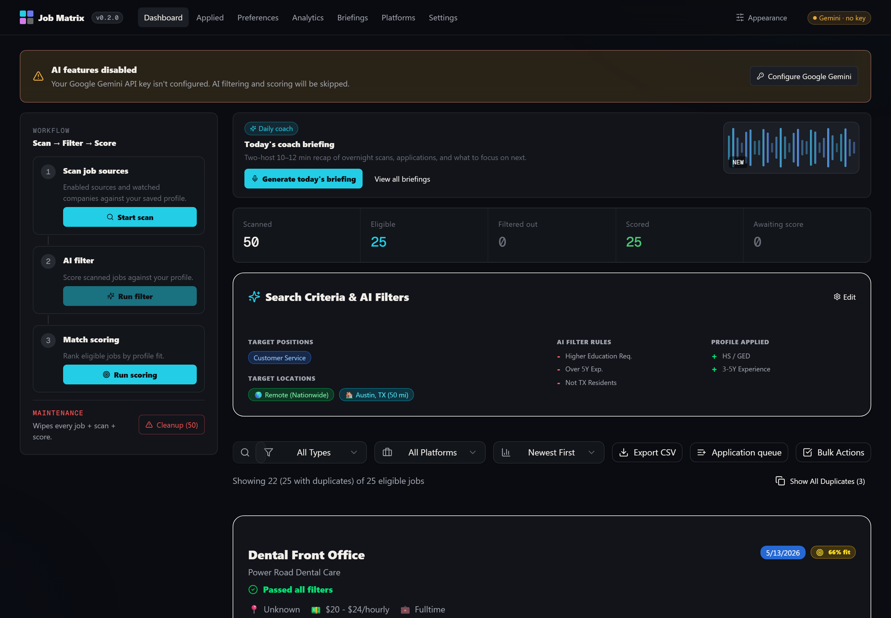
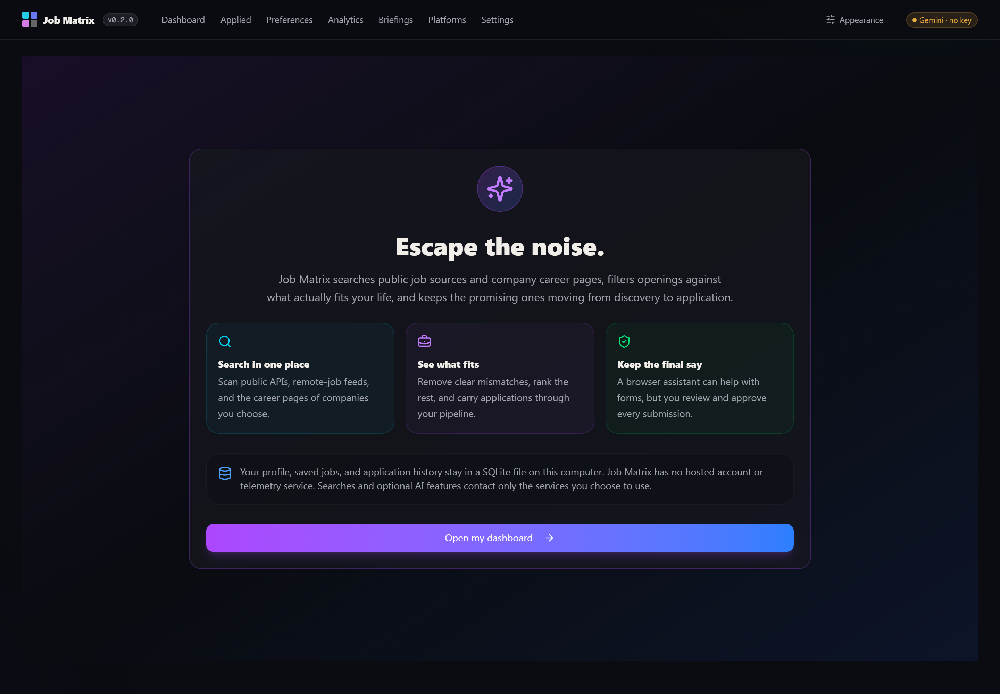
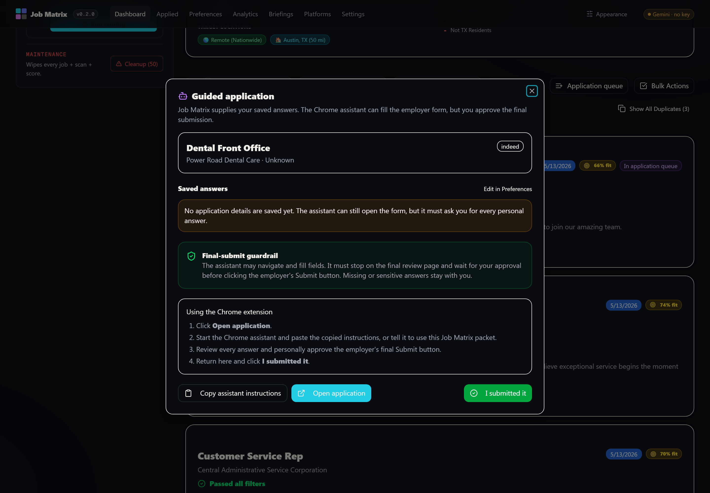

# Job Matrix

**A local job-search workspace that finds openings across public job sources and
company career pages, filters them against what actually fits your life, and
helps you carry promising roles from discovery through application.**

You tell Job Matrix what kind of work fits your circumstances. It searches,
removes clear mismatches, ranks the remaining jobs, and keeps your applications
organized on your own computer. When you want help, a browser assistant can
work through the same interface you see while leaving final decisions with you.



*The dashboard turns a pile of listings into a visible workflow: search, filter,
score, review, and apply.*

> **Beta:** Job Matrix is usable today, but it is still a self-hosted developer
> release. Job sources and AI providers can change independently of the app, so
> the interface reports source health instead of promising permanent coverage.

---

## Who this is for

You might be:

- **Someone whose job search has become a second job** and wants one place to
  search, remove obvious mismatches, and remember what happened next.
- **A job seeker with real constraints**—location, pay, education, experience,
  schedule, or work style—who is tired of boards treating relevance as an
  afterthought.
- **Someone who wants AI assistance without surrendering the application.** A
  browser assistant can prepare forms, but it stops before the employer's final
  Submit button and waits for you.
- **A developer or accessibility-minded designer** interested in software that
  a person and their trusted agent can operate through the same interface.

If any of that sounds familiar, keep reading.

---

## What it actually does

1. **You describe the work that fits.** Add target roles, locations, pay needs,
   education, experience, and any deal-breakers that matter to you.
2. **You choose where to look.** Search public job APIs, remote-work feeds,
   optional JobSpy-backed sources, and the public career pages of companies you
   want to watch.
3. **Job Matrix gathers and deduplicates listings.** The same opening appearing
   on multiple sources is grouped instead of becoming more noise.
4. **Rules remove clear mismatches.** Optional AI filtering can evaluate the
   listing against your saved profile and flag scams, MLM language, education
   conflicts, experience conflicts, location restrictions, and pay problems.
5. **The remaining jobs are ranked.** Fit scoring gives you a starting point for
   review; it does not make the decision for you.
6. **You carry promising jobs forward.** Save them to an application queue,
   track interviews and offers, keep a timeline, and export your records.
7. **A browser assistant can help with repetitive forms.** Job Matrix prepares
   a packet from answers you chose to save. The assistant may navigate and fill,
   but you review the result and personally approve the final submission.
8. **Optional response monitoring closes the loop.** A read-only Gmail
   connection can recognize likely employer responses and Google Voice email
   notifications; Slack alerts are optional.



*The front door explains the bargain before asking for anything: Job Matrix does
the repetitive work, your records stay local, and the consequential choices stay
with you.*

---

## Why this is different from another job board

Job Matrix does not own a marketplace of listings and has no incentive to keep
you scrolling. It is a workspace you run for yourself.

- **Your working record stays on your machine.** There is no Job Matrix account,
  hosted database, or telemetry collector.
- **You choose the sources.** Six public job APIs/feeds are supported, alongside
  public Greenhouse, Lever, Ashby, and Workday career boards and optional
  best-effort JobSpy sources.
- **Your circumstances drive the filter.** Relevance means more than matching a
  title. Job Matrix can account for the constraints you decide to save.
- **Assistance remains reviewable.** The browser assistant sees the same
  interface and application packet you see. There is no hidden AI-only workflow.
- **Failure is visible.** Source errors and partial scans are reported as errors
  or partial results rather than being converted into reassuring empty success.

### Agentic Accessibility

Job Matrix was built around a simple idea: software should not need a separate,
hidden interface before a trusted assistant can help operate it. Interactive
surfaces carry stable semantic hooks, keyboard navigation, and accessible state
that benefit browser agents and assistive technology at the same time.

That does not mean the agent owns the workflow. It means the interface is
legible enough for the person to delegate repetitive steps without losing the
ability to inspect, interrupt, or decide. The longer argument lives in
[`VISION.md`](VISION.md).



*The guided application packet is the clearest expression of the idea: saved
answers are visible, missing answers remain questions, and final submission is a
human approval boundary.*

---

## Try it yourself

> **Heads up:** today this is a self-hosted developer tool. You will clone a Git
> repository and install Node.js and Python dependencies. Some searches work
> without credentials; AI filtering requires a key from a supported provider.

### What you will need

- [Node.js](https://nodejs.org/) 22 or newer.
- [pnpm](https://pnpm.io/installation) 10 or newer.
- [Python](https://www.python.org/downloads/) 3.9 or newer for JobSpy sources
  and optional NotebookLM features.
- Optional credentials for the job sources and AI provider you choose. The app
  explains each one under Settings.

### Steps

```bash
git clone https://github.com/anitacigawet/Job-Matrix.git
cd Job-Matrix
pnpm setup
pnpm dev
```

Open <http://127.0.0.1:3000>. First-run setup creates a local SQLite database
and asks which roles and locations matter to you. There is no login flow.

`pnpm setup` is safe to run again after a partial installation. For a production
build:

```bash
pnpm build
pnpm start
```

### AI providers

Job Matrix can call Google Gemini, OpenAI, or DeepSeek directly. You need only
one provider, and you can change it later under Settings. Provider names and
default models are configuration rather than promises; use a currently
available model your account supports.

### Job sources

The source layer has three distinct shapes:

- **Public APIs and feeds:** Adzuna, USAJobs, Jooble, The Muse, Remotive, and
  RemoteOK. Some work without signup; others require free or partner credentials.
- **Company career boards:** public Greenhouse, Lever, Ashby, and Workday feeds
  selected from the maintained company catalog.
- **Best-effort scrapers:** optional JobSpy support for Indeed, LinkedIn,
  Glassdoor, ZipRecruiter, and Google Jobs. These are more fragile and may stop
  working when the underlying sites change or block automated requests.

Live results matter more than a README timestamp. Check **Platforms → Health &
telemetry** for what this installation has actually observed.

---

## Data and privacy

Job Matrix is local-first, not offline-only.

**Stored on your computer:** your profile, search preferences, listings, scan
history, application records, uploaded résumé, provider settings, and generated
briefings. The local server listens only on `127.0.0.1`.

**Sent when you ask for it:**

- Search terms and locations go to the job sources you enable.
- Listing text and relevant profile criteria go to your selected AI provider
  when you request filtering or scoring.
- Résumé text goes to that provider only when you request extraction or critique.
- A plausibly job-related email may go to the selected provider when local rules
  cannot classify it confidently. Unrelated mail is discarded before that step.
- Requested briefing context goes to Google NotebookLM when you enable or
  generate a briefing.
- Matched response details go to Slack only when you configure Slack alerts.

If you want the narrowest network footprint, leave AI, NotebookLM, Gmail, Slack,
and credentialed sources disabled and use only sources you are comfortable
contacting.

---

## What works today

- Local onboarding, profiles, role preferences, search presets, and watched
  companies.
- Multi-source searches, deduplication, source health, cancellation, and scan
  history.
- Rule-based and optional AI-assisted filtering plus fit scoring.
- Application queue, guided browser-assistant packet, final-submit guardrail,
  pipeline tracking, timeline, analytics, and CSV export.
- Optional read-only Gmail response monitoring, Google Voice email recognition,
  and Slack alerts.
- Optional NotebookLM audio, visual, and text briefings.
- Dark/light appearance controls, responsive navigation, keyboard shortcuts,
  and documented semantic hooks for browser agents.

## Known limits

- There is no hosted edition; the local server must be running.
- Job-source coverage changes over time, especially scraper-backed sources.
- AI judgments are suggestions. Read the listing and verify the employer before
  acting.
- Response monitoring is not a general email client and may require review when
  classification is uncertain.
- NotebookLM integration depends on an unofficial local bridge and a live Google
  session, so it is more experimental than the core search and tracking flow.

---

## How this repository is organized

- **`client/`** — the React interface used by the person and browser assistant.
- **`server/`** — the local Express/tRPC service, source adapters, filtering,
  application workflow, and optional integrations.
- **`shared/`** — types, platform definitions, and shared catalog rules.
- **`drizzle/`** — the local SQLite schema and migrations.
- **`companies-catalog.yaml`** — maintained public ATS-board catalog.
- **`docs/CONCIERGE_PROMPT.md`** — a tested prompt for a browser assistant.
- **`docs/internal/`** — architecture, decisions, active work, and the semantic
  hook inventory for contributors.
- **`VISION.md`** — the Agentic Accessibility thesis behind the product.

---

## Contributing and maintenance

Bug reports, company suggestions, and focused code contributions are welcome.
Please open an issue before a code pull request so the approach can be checked
against the project's local-first and human-approval boundaries. The company
catalog is maintainer-curated; suggest additions through its issue template
rather than editing the catalog directly.

Job Matrix is maintained on a best-effort basis. An issue is an invitation to
investigate, not a promise of a roadmap or response date. See
[`CONTRIBUTING.md`](CONTRIBUTING.md) and [`SECURITY.md`](SECURITY.md).

---

## Credits

Job Matrix is directed and maintained by James with extensive assistance from
generative-AI development tools. That collaboration is part of the project, not
a hidden disclaimer: the application is itself an experiment in building one
legible interface for a person and the trusted agents working at their direction.

Job Matrix began as a way to make
[JobSpy](https://github.com/speedyapply/JobSpy)'s job-board aggregation useful
from one local, human-readable workspace. JobSpy remains the foundation of the
optional scraper tier; Job Matrix adds the dashboard, local tracking, source
adapters, application workflow, and human-approval boundaries around it.

JobSpy and the project's other open-source dependencies remain the work of
their respective contributors. Their licenses and notices are preserved in
[`THIRD_PARTY_NOTICES.md`](THIRD_PARTY_NOTICES.md) and in the dependencies
themselves.

---

## A note on intent

Job hunting asks people to repeat the same facts, scan the same noise, and spend
attention proving themselves to systems that forget them immediately. Job Matrix
does not make the important decisions for you. It gives the repetitive parts a
place to live so your attention can stay on whether the work is real, whether it
fits, and whether you want it.

---

## License

Job Matrix is source-available under the
[PolyForm Noncommercial License 1.0.0](LICENSE). You may inspect, use, modify,
and share it for noncommercial purposes. Commercial use is not permitted.

JobSpy remains a separate MIT-licensed dependency. Third-party job data,
employer names and marks, provider services, and other dependencies remain
governed by their respective owners and terms.
