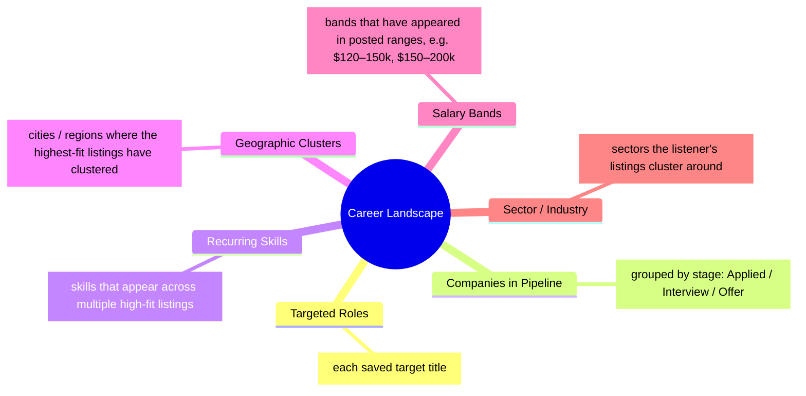

# Career Path Mind Map — design notes

We don't have access to NotebookLM's native Mind Map Studio output here (separate path that requires more wiring). Instead, render this as a **Mermaid mindmap diagram embedded in markdown** plus a short narrative interpretation. The user can paste the Mermaid block into any markdown viewer that supports it (GitHub, Obsidian, etc.) for the visual; the narrative reads alone.

## Instructions (sent to Studio)

Produce a **markdown document** containing:

1. A short framing paragraph (3–4 sentences) summarising what this mind map shows and what the listener should take away.
2. A **Mermaid `mindmap`** code block visualising the structure (see structure below).
3. A short interpretation section (300–500 words) walking through the most interesting branches.

### The Mermaid structure

Populate each branch with **only data that's actually in the source document**. If a branch has no data, drop it from the mindmap — don't invent.

### The interpretation section

Walk through 3–4 of the most interesting branches in prose:

- **Pattern observed.** ("Most of the listener's high-fit listings cluster in fintech and dev-tools — a sector pull they may not have explicitly chosen.")
- **What it might mean.** Brief, grounded interpretation.
- **Suggested action.** One sentence on what the listener might do with that observation.

End with a one-paragraph synthesis pulling the patterns together.

**Tone constraints.**

- Observation-rich, lightly interpretive. The user is the one who decides what to do with the patterns; you're just surfacing them.
- Use the listener's actual saved titles, companies, and skills wherever possible — generic mindmaps are valueless.

**Forbidden.**

- Filling in branches with plausible-sounding but fabricated content (e.g. inventing companies).
- More than 6 top-level branches in the mindmap. Cluttered mindmaps don't read.
- Hustle-culture vocabulary in the interpretation.
- Telling the listener what to do — frame as suggestions, not prescriptions.
